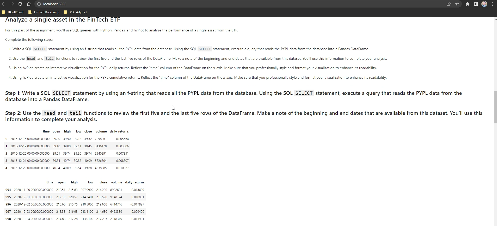
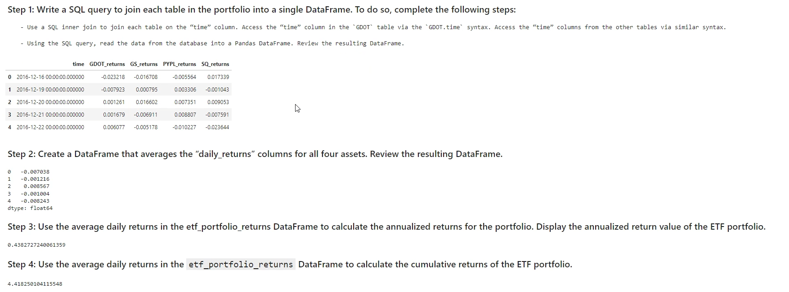

# Images

# ETF Performance Analysis

This program provides a performance analysis of a FinTech ETF portfolio consisting of four stocks: GDOT, SQ, PYPL, and MELI. It includes interactive visualizations of daily returns, cumulative returns, and other key metrics. The project uses SQL queries to fetch data from a SQLite database and then processes and visualizes the data using Python and the HvPlot library.

## Technologies

This project utilizes the following technologies:

- Python 3.7+
- Pandas
- NumPy
- HvPlot
- SQLite
- SQLAlchemy
- Jupyter Notebook

## Usage

1. Clone this repository to your local machine.
2. Install the required dependencies by running `pip install -r requirements.txt` in your terminal.
3. Open the Jupyter Notebook `etf_performance_analysis.ipynb` in Jupyter.
4. Run the cells in the Jupyter Notebook to fetch data from the SQLite database, process the data, and visualize the results using interactive plots.

Please note that the analysis and visualizations are based on historical data and should not be considered as a guarantee of future performance. The tool is designed to provide insights for informed decision-making and should be used in conjunction with other sources of information and professional advice.

## Contributors

This project was made possible by the teachings of our wonderful instructor, Firas, along with contributions by James White.

## License

You may use this source code as you need to.
